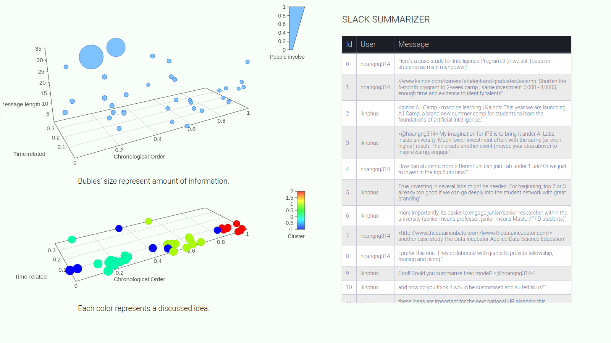

# slack-visual-summary
Using Machine Learning to create a visual summary for Slack channels. 

## Google slide about project

## Sentences Clustering
The Machine Learning model in **sent2vec-ver2** folder turns sentences in a messages into a sentence-embeddings and extract other sentence's features.
The model need the file : https://drive.google.com/open?id=0BxO5mNtEpj_gZ2YtSFFOcG9SSXc

## Slack's Slash command
The Slack's Slash command interface is hosted in AWS Lambda function.
Each file/folder in **aws-lambda** is a AWS Lambda function.

## Website to visually summarize the conversations
In **website** model.
