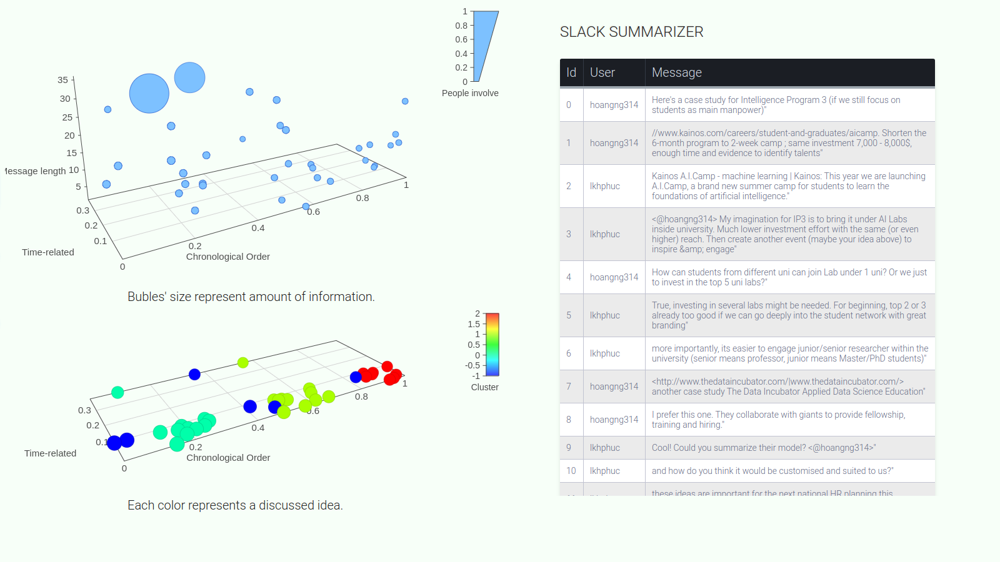

This is a project created during the Intelligence Program 2017 by [Cinnamon AI Lab](https://cinnamonailabs.wordpress.com/) by [Phuc Le](https://lkhphuc.github.io), [Le Ngoc Phu](https://github.com/lephu0803), [Nguyen Hoang](https://github.com/amidadragon).
# slack-visual-summary
Using Machine Learning to create a visual summary for Slack channels. 

## Google slide about project
<iframe src="https://docs.google.com/presentation/d/e/2PACX-1vSpusrJTGZ6pAG0LuaSzJkzmMoMr4yIENQ81R9ZLlUEhNwjMqK3vZOeUKsONF6ouh4xDTvXTQMrDqnj/embed?start=false&loop=false&delayms=3000" frameborder="0" width="1440" height="839" allowfullscreen="true" mozallowfullscreen="true" webkitallowfullscreen="true"></iframe>

